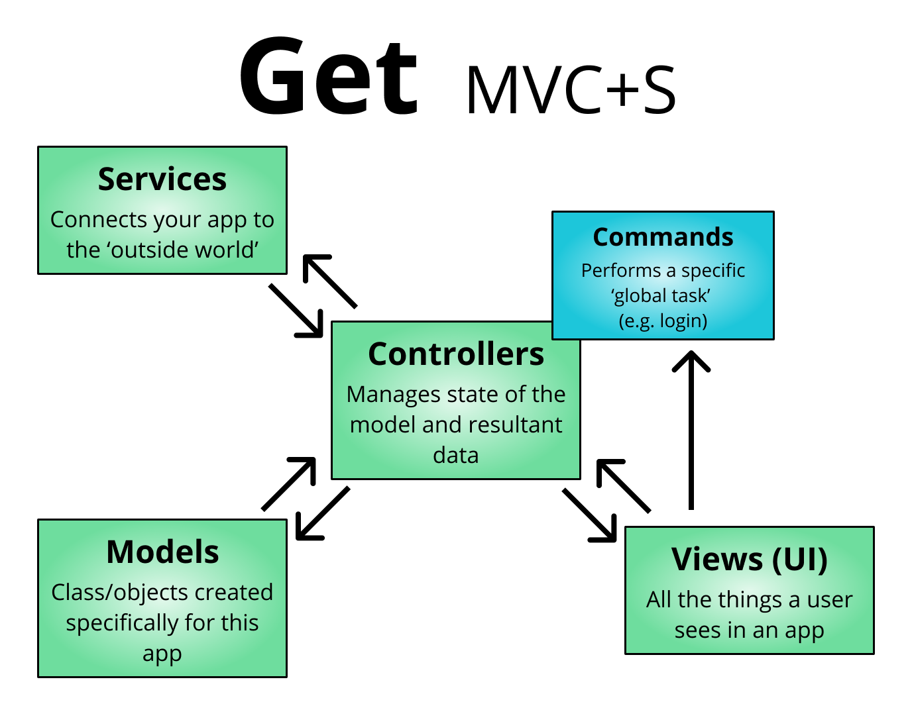

# PRAPARE

A patient-facing Flutter app that allows for entry of Social Determinants of Health (SDOH) data in their own native language.

This app directly builds off of the work pioneered in the [PRAPARE] project, though at this time it is not formally affiliated with PRAPARE.

A related [Youtube playlist] and a [demo repository] exist to teach the concepts & components used when building this app. 


## Design

A basic [prototype] and relevant [wireframes] were created in Figma prior to app creation.

## Architecture

This app loosely follows the [Model-View-Controller+Services] `(MVC+S) architecture`, which has both [simple] and [production-level] examples of use. Whereas the above examples make heavy use of Provider, ChangeNotifier, and StatefulWidgets, we are instead using [Get] and some of the [Getx pattern] to simplify state management, routing, and dependency injection.

Our take on MVC+S is as follows:

- `model`: Class/objects created specifically for this app
- `views`: The UI layer, which is separated into multiple `pages` and may optionally be managed via a `viewcontroller`
- `controller`: Manages state of the model and resultant data. Controller classes typically extend `GetxController` (automatically disposed) and `GetxService` (rarely/never disposed)
- `service`: Connects your app with the outside world (e.g. internet or local file system).
- `command`: A high level function that performs a specific task, such as login/logout. It may utilize controllers, APIs, models, etc as necessary.


## Folder Structure

The following is the folder structure under the `/lib` folder:

| Folder | Subfolder | Description |
| --- | --- | --- | 
| /_internal                           || custom components/variations of existing Flutter widgets, utils, constants, and the like|
|| /constants                         | local constants created for the app| 
||  /utils                             | local functions that do things like formatting | 
||  /extended_widgets                  | custom variations on Flutter widgets| 
| /controllers                         || manages state of the model and resultant data| 
||  /commands                          | performs a specific global task (login, logout, change password)
||    ../<command_name>/
||    ../../<command_name>_controller.dart
||    ../../<command_name>_state.dart
||    ../../<command_name>_event.dart      
||  /local       | state management (TBD). see above for state management discussion| 
|/models                              || class/objects created specifically for this app| 
||  /value_objects                     | objects with built-in validation| 
||  /failures           
||  /data                              | data models| 
|/services                            || interaction with the outside world (REST, http, file storage)
|/ui                                  || essentially all things a user sees in the app| 
||  icons.dart                         | icons| 
||  themes.dart                        | custom themes and font sizes| 
||  /styled_components                 | shared widgets that use a common design system / theme so that the app seems consistent across screens
||    ../<widget_name>.dart
||  /views                             | top level widgets that are loaded via a route| 
||    ../<screen_name>/                   || contains all code specific to this screen that is not shared
||      ../../<screen_name>.dart             | the screen widget, may optionally include 'page', 'card', or 'panel' at the end based on view type
||      ../../<screen_name>_binding.dart     | controllers/services that are loaded (or lazy-loaded) in a view
||      ../../<screen_name>_controller.dart  | the viewcontroller that only affects this screen  widget
||      ../../<screen_name>_test.dart        | any relevant tests for the screen widget or its viewcontroller
|/routes                              || maps route to screen widgets| 
||  app_pages.dart                     | the app|
||  app_routes.dart                    | string route names used in the app| 
|strings.dart                         || translations| 

## Questionnaire vs Survey

To differentiate between FHIR and our local data model, we have employed the term ```Survey```

- When an item is specifically related to FHIR and it's formatting, the term Questionnaire is used, along with the formatting for that FHIR resource
- When it is part of the local model (including locally stored surveys/questionnaires) the term survey is used 

## To Use the Questionnaire Package
You would create a new object:
```
var questionnaire = FhirQuestionnaire();
```
Load the survey (currently hardcoded into the app, but will soon have ability to download from url)
```
questionnaire.loadAndCreateSurvey();
```
Anytime that a user has answered questions that you would like to keep track of, you can pass them back like this:
```
final responses = [
  UserResponse(
      surveyCode: '/93043-8',
      questionCode: '/93043-8/56051-6',
      answerCode: 'LA33-6'),
  UserResponse(
      surveyCode: '/93043-8',
      questionCode: '/93043-8/32624-9',
      answerCode: 'LA14042-8'),
];

questionnaire.getUserResponses(responses);
```
This can be done multiple times or once, the object will simply keep it as a list until you are finished. Then, when you're ready to create the final response, call the method:
```
questionnaire.createResponse();
```
Now you have a QuestionnaireResponse item that you can do with as you will. To print for instance:
```
print(questionnaire.response.toJson());
```


## Style Guide

Follow the [Dart style guide].

Of note, you should:

- Use `UpperCamelCase` for types.
- Use `lowercase_snake_case` for libraries, packages, directories, and files.
- Use `lowerCamelCase` for constant names.
- Use `lowerCamelCase` for everything else (like variable names).
- Capitalize acronyms and abbreviations longer than two letters (Http rather than HTTP or http).
- A leading underscore makes a member variable private. Only use it if it is private.
- You can use single line if statements for returns.
- Use `///` instead of `/** */` for multi-line comments.

For VS Code, install the Dart and Flutter plugin. Set your editor to [format on save].

## Questions

We have a [Slack channel] and welcome new members/contributors.

[demo repository]: https://github.com/FireJuun/get_fluttered
[Dart style guide]: https://dart.dev/guides/language/effective-dart/style
[format on save]: https://flutter.dev/docs/development/tools/formatting#automatically-formatting-code-in-vs-code
[Get]: https://pub.dev/packages/get#the-three-pillars
[Getx pattern]: https://github.com/kauemurakami/getx_pattern
[Model-View-Controller+Services]: https://blog.gskinner.com/archives/2020/09/flutter-state-management-with-mvcs.html
[PRAPARE]: https://www.nachc.org/research-and-data/prapare/
[production-level]: https://github.com/gskinnerTeam/flokk
[prototype]: https://www.figma.com/proto/cWKc5iTzhoddhxMov05rWG/PRAPARE?node-id=5%3A2&scaling=scale-down
[simple]: https://github.com/gskinnerTeam/flutter-mvcs-hello-world
[Slack channel]: https://bit.ly/flutterjuun-slack
[wireframes]: https://www.figma.com/file/cWKc5iTzhoddhxMov05rWG/PRAPARE?node-id=0%3A1
[Youtube playlist]: https://www.youtube.com/playlist?list=PL_e311Xg2aCQX98onj3OZ2XAE5vm8fCI1